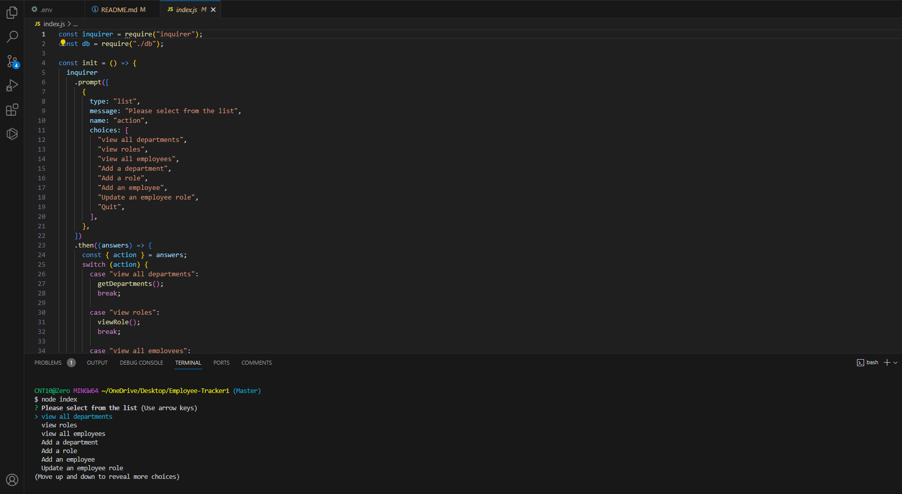

  # Employee-Tracker1

  ## Description
  This is a app that keep tracker of your employee and it runs thought your terminal  you can view deparments, view roles, add departments and roles 

  ## Table of Contents
  - [Installation](#installation)
  - [Usage](#usage)
  - [Contributors](#contributors)
  - [License](#license)
  - [Features](#features)
  - [Questions](#questions)
  - [Test](#tests)

  ## Installation
  in order to install this you will need node.js, Mysql2 inquirer and a vscode program

  ## Usage
  To keep track of your business 

  